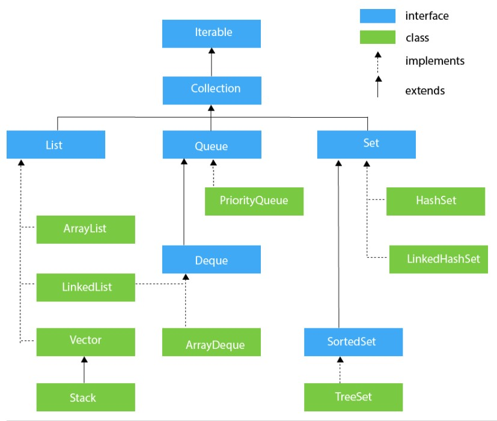

# Java Collection

Collection adalah suatu objek yang biasanya dibuat untuk mengumpulkan, menyimpan, dan memanipulasi kumpulan data. Java menyediakan banyak class generic yang bisa langsung digunakan dengan tipe data apapun. Berikut adalah gambar hirarki pada Java Collection.



## Interface Iterable dan Iterator

Hirarki paling atas ditempati oleh interface Iterable. Dengan kata lain, interface Iterable adalah parent untuk semua Collection kecuali Map.

Sesuai namanya, iterable, interface ini digunakan hanya agar semua collection di Java dapat melakukan for-each loop. Hal ini memungkinkan dengan adanya bantuan interface Iterator. Sebelum adanya for-each loop, Iterator ini umum digunakan dengan contoh kode seperti berikut.

```Java Contoh Kode Iterator
Iterator<String> iterator = names.iterator();

while (iterator.hasNext()) {
    String name = iterator.next();
    System.out.println(name);
}
```

## Interface Collection

Hirarki kedua ditempati oleh interface Collection. Interface ini menyediakan suatu kontrak arsitektur yang digunakan untuk menyimpan dan memanipulasi kumpulan data. Collection diimplementasikan melalui hirarki dibawahnya, yaitu List, Set, dan Queue.

## Interface List

Interface List adalah salah satu turunan dari interface Collection.
