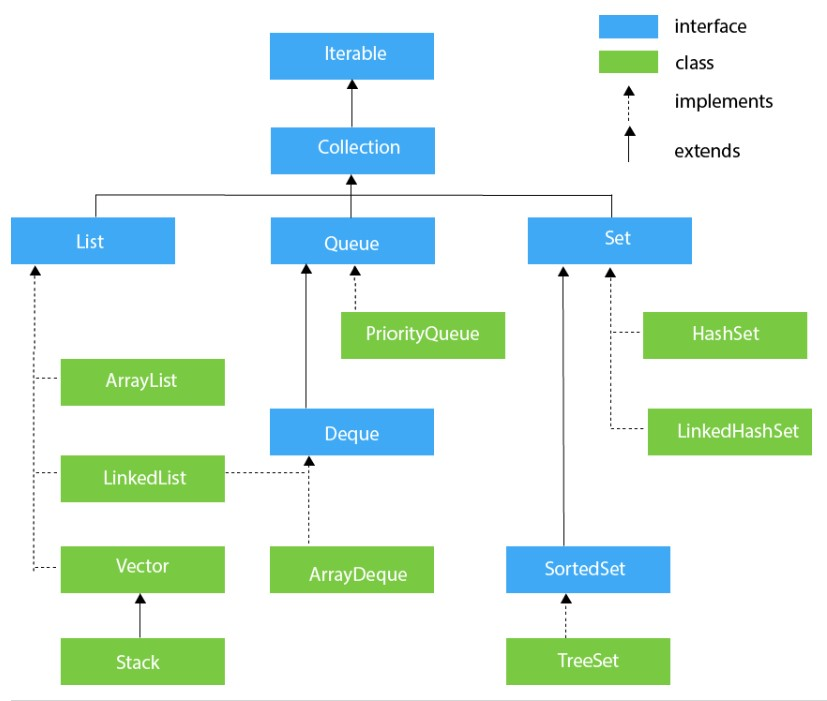
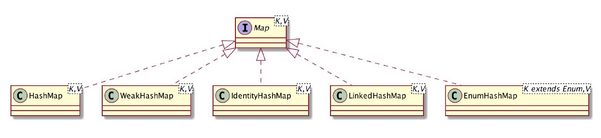

# Java Collection

Collection adalah suatu objek yang biasanya dibuat untuk mengumpulkan, menyimpan, dan memanipulasi kumpulan data. Java menyediakan banyak class generic yang bisa langsung digunakan dengan tipe data apapun. Berikut adalah gambar hirarki pada Java Collection.



## Interface Iterable dan Iterator

Hirarki paling atas ditempati oleh interface Iterable. Dengan kata lain, interface Iterable adalah parent untuk semua Collection kecuali Map.

Sesuai namanya, iterable, interface ini digunakan hanya agar semua collection di Java dapat melakukan for-each loop. Hal ini memungkinkan dengan adanya bantuan interface Iterator. Sebelum adanya for-each loop, Iterator ini umum digunakan dengan contoh kode seperti berikut.

```Java
Iterator<String> iterator = names.iterator();

while (iterator.hasNext()) {
    String name = iterator.next();
    System.out.println(name);
}
```

## Interface Collection

Hirarki kedua ditempati oleh interface Collection. Interface ini menyediakan suatu kontrak arsitektur yang digunakan untuk menyimpan dan memanipulasi kumpulan data. Collection diimplementasikan melalui hirarki dibawahnya, yaitu List, Set, dan Queue.

## Interface List

Interface List adalah salah satu turunan dari interface Collection. List juga disebut sebagai Sequence atau Collection yang berurutan. Data yang disimpan pada list boleh memiliki value null dan value yang sama (duplikat). List memiliki method berbasis index yang memungkinkan kita melakukan operasi CRUD menggunakan posisi index pada list. Ada banyak implementasi dari interface List, di antaranya adalah ArrayList dan LinkedList.

### Class ArrayList dan LinkedList

ArrayList dan LinkedList berada di bawah hirarki Interface List. Keduanya adalah bentuk implementasi class dari interface List. Perbedaan jelas pada keduanya adalah sistem penyimpanan data yang digunakan. Jika LinkedList menggunakan Double Linked List untuk menyimpan datanya, class ArrayList menggunakan "Array dinamis". Array pada ArrayList memiliki panjang default 10 index. Ketika seluruh index telah terisi data, ArrayList akan membuat array baru dengan panjang index menyesuaikan jumlah setiap data yang baru masuk. Perbedaan selengkapnya antara ArrayList dan LinkedList terangkum pada tabel di bawah.

| ArrayList | LinkedList |
|-|-|
| ArrayList menggunakan Array untuk menyimpan data. | LinkedList menggunakan Double Linked List untuk menyimpan data. |
| Saat diinisiasi, ArrayList memiliki kapasitas default 10. |  Tidak ada kapasitas default pada LinkedList. Saat diinisiasi, LinkedList hanya membuat list kosongan |
| ArrayList hanya mengimplementasikan interface List. | LinkedList mengimplementasikan interface List dan Deque. |
| ArrayList lebih cepat dalam melakukan get dan set. | LinkedList lebih cepat dalam melakukan add dan remove. |

## Interface Queue

Interface Queue merupakan salah satu turunan dari Interface Collection yang menampung data secara berurutan. Lebih tepatnya, Queue adalah implementasi dari struktur data antrian First In First Out (FIFO). Interface Queue bisa langsung diimplementasikan melalui Priority Queue atau diimplementasikan menjadi ArrayDeque dan LinkedList melalui Interface Deque.

| ArrayDeque | LinkedList | PriorityQueue |
|-|-|-|
| Memanfaatkan Array | Menggunakan Double Linked List | Memanfaatkan Array dengan bantuan Interface Comparable dan Comparator |

## Interface Deque

Deque adalah singkatan dari Double Ended Queue. Artinya, antrian data bisa dilakukan dari arah depan dan belakang. Sehingga, metode antrian yang bisa diimplementasikan bukan lagi hanya First In First Out, namun juga Last in First Out (stack). Berikut ini adalah contoh kode stack data menggunakan ArrayDeque.

```Java
Deque<String> stack = new ArrayDeque<>();

stack.offerLast("String1");
stack.offerLast("String2");

for (var string = stack.pollLast(); string != null; string = stack.pollLast()) {
	System.out.println(string);
}
```

## Interface Set
Interface Set juga merupakan salah satu implementasi dari Collection seperti halnya interface List. Tapi, yang menjadi pembeda antara List dan Set adalah duplikasi data. Tidak seperti List, interface Set tidak bisa memiliki data yang sama (duplikat). Set hanya memiliki method yang diturunkan dari Collection dengan menambahkan batasan larangan terhadap duplikasi data. Mengimplementasikan set bisa dilakukan melalui class-class turunan set seperti HashSet, LinkedHashSet, atau TreeSet.

## Interface Map

Map adalah suatu objek yang memetakan sekumpulan pasangan data, antara key dan value. Setiap key yang berada di dalam map tidak boleh sama (duplikat) dan setiap key hanya bisa dipetakan kepada satu value. Map memiliki hirarkinya sendiri. Merujuk pada [situs dokumentasi resmi Oracle](https://docs.oracle.com/javase/8/docs/technotes/guides/collections/designfaq.html#a14), collection bukanlah map dan sebaliknya. Kurang masuk akal apabila map adalah turunan atau hasil extend dari collection.



### Class HashMap

HashMap merupakan salah satu implementasi dari interface Map yang berbasis tabel hash. Tapi yang membedakan antara HashMap dengan tabel hash adalah, key dan value yang disimpan boleh null. HashMap mendistribusikan key nya melalui method hashCode(). Sehingga jika semakin banyak nilai hashCode() yang sama, maka distribusi key tidak bisa optimal, yang mengakibatkan kemacetan arus data pada HashMap. Berikut adalah contoh kode pemetaan key dan value menggunakan HashMap.

```Java
Map<String, String> map = new HashMap<>();
map.put("key1", "value1");
System.out.println(map.get("key1"));
```

---